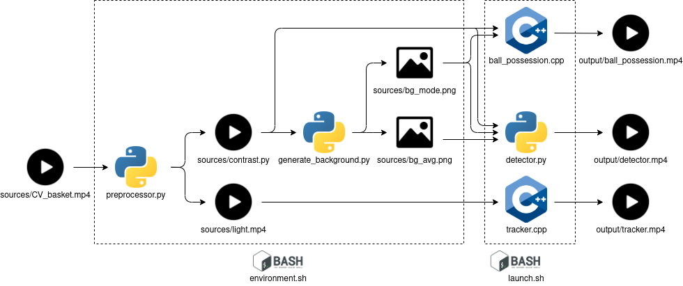

# Computer Vision Assignment

Ivan Martini #207597

This repo is my official one for the assignments of the course of Computer Vision offered by the University of Trento, year 2020/2021.

## First Assignment

The first assignment was just a theoretical report, a case study on some technologies that actually changed some sports. I chose basketball and the file is `report/Report_FirstAssignment.pdf`

## Second Assignment

The second assignment is the practical one. The input is a brief video of the Aquila Basket playing a match, through a fixed camera (1422x1080) which covers the whole field. The desired output is some computation and statistics on the teams.

This `README.md` includes a guide to set up the environment, but the description of the complete pipeline is found in the second report `report/Report_SecondAssignment.pdf`

### Architecture



### Setup

0) **Prerequisites**: Have `python` installed, `opencv` (for C++) and `cmake`. This should be the only non standard packages for any \*nix like OS, if they are not, please let me know.

1) Clone the repository
```
git clone https://github.com/iron512/CVassignment
```
2) Copy the video, which is not uploaded in the repo inside the `sources` folder.
3) Add the execution command on the `bash` scripts (might require sudo permissions).
```
chmod +x ./environment.sh
```
```
chmod +x ./launch.sh
```
4) Set up the environment (~10 min)
```
./environment.sh
```
5) Launch the modules that take care of the tasks (~4 min)
```
./launch.sh
```

*Please take not that the timing is referred on the test I run on my computer, which mount a 7th-gen i7 7700HQ and a GTX1050m*